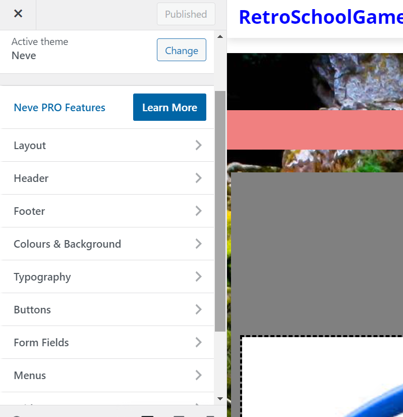

# Pratical 3 
Name: Matthew Ballarino

# Learning Activities

Watch the JCU video made by Linsday. After that went to watch the videos on LinkedIn that were recommend that clarified WordPress a bit easier. YouTube and other forms of media made it easier to complete the work.  

# Resources and Links

How to display a list of posts by category on any page in WordPress
https://www.youtube.com/watch?v=AMhlAGcndOI 

How To Make a WordPress Blog - Step by Step
https://www.youtube.com/watch?v=BhltwjuiEk4

# Estimated Hours

I spent probably half the week trying to create the WordPress site I was very productive once I started going the LinkedIn were very helpful.

# Content Insights

I am very grateful for using WordPress, I found using WordPress to be more comfortable to using instead of Joomla as WordPress interface felt easier to use. The lecture video helped me understand the basic core functions of where to start. The LinkedIn video helped me gain clarifier a few things such as blocks. When doing the website, I found it easier to use the CSS instead of the editing sidebar thing and the CSS style sheet allow me to edit more compared to what the sidebar offered. 

# Career/Employability/Learning Insights
This practical in my opinion will be helpful as plan on improving the website in particular the blog as what a category system that sorts the blog posts and only display the post that is needed, I also planned to have a forum kinder like reddit but first want to work on other features such as blog and login in. So yes, the skills I learned would be more helpful later when improving the website for the assignment.
The JCU video was also helpful as showed me how to host a WordPress through local hosting which would be extremely helpful later down the line as wordpress is used a lot on the website make industry. 

